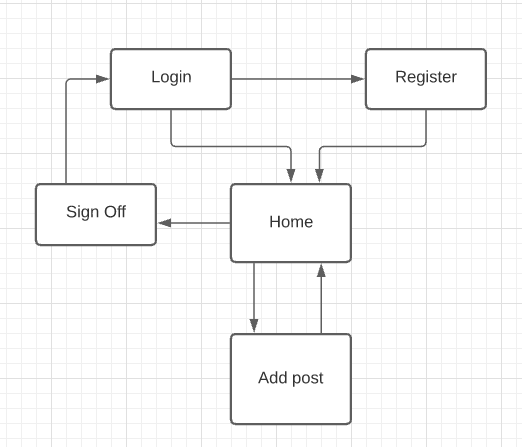
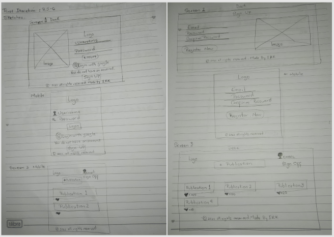
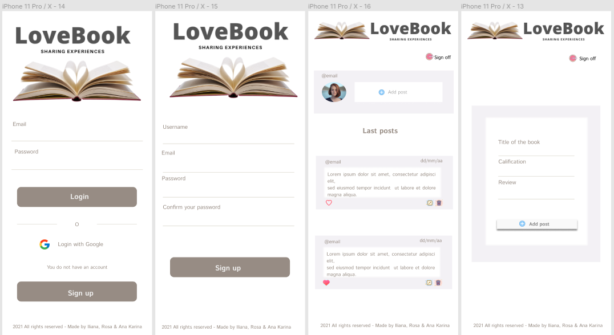

# Creando una Red Social

## Índice

* [1. Resumen del proyecto](#1-resumen-del-proyecto)
* [2. Quiénes son los principales usuarios de producto.](#2-Quiénes-son-los-principales-usuarios-de-producto)
* [3. Qué problema resuelve el producto / para qué le servirá a estos usuarios.](#3-Qué-problema-resuelve-el-producto-/-para-qué-le-servirá-a-estos-usuarios.)
* [4. Criterios de aceptación mínimos del proyecto](#5-criterios-de-aceptación-mínimos-del-proyecto)
## 1. Resumen del proyecto

En este proyecto construiremos una Red Social, la cual permitirá a cualquier usuario crear una cuenta de
acceso y loguearse con ella; crear, editar, borrar y _"likear"_ publicacciones.
 
El objetivo principal de aprendizaje de este proyecto es construir una
[Single-page Application (SPA)](https://es.wikipedia.org/wiki/Single-page_application)
[_responsive_](https://curriculum.laboratoria.la/es/topics/css/02-responsive) (con más de una vista / página)
en la que podamos **leer y escribir datos**.

## 2. Quiénes son los principales usuarios de producto.
  Personas que les guste leer, compartir y escribir reviews de libros.  
## 3. Qué problema resuelve el producto / para qué le servirá a estos usuarios.
  Para hacer una mejor elección del siguiente libro que quieres leer basado en las opiniones de otras personas. 
## 4. Criterios de aceptación mínimos del proyecto
### 4.1 Historias de usuario

 **Criterios de Aceptación:** todo lo que debe ocurrir para satisfacer las
  necesidades del usuario.

* **Definición de terminado:** 

### 4.2 Diseño de la Interfaz de Usuario 
#### Flujo de la aplicación:
 
#### Prototipo de baja fidelidad:

#### Prototipo de alta Fidelidad:

