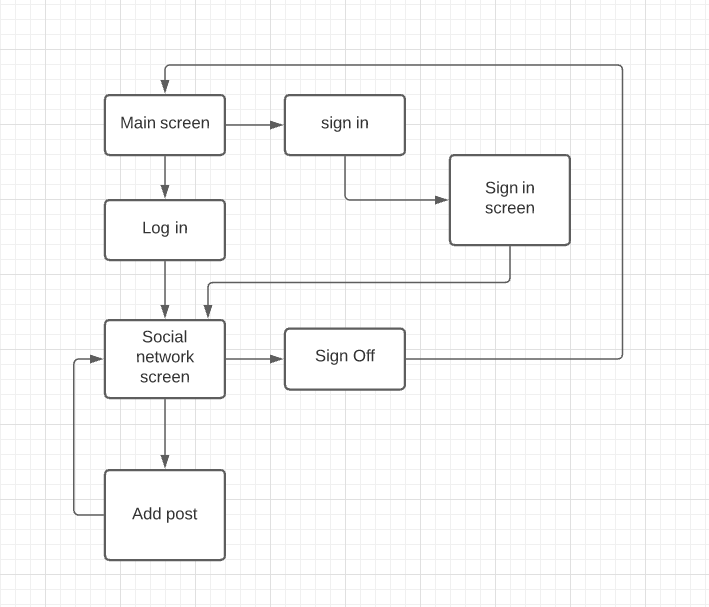
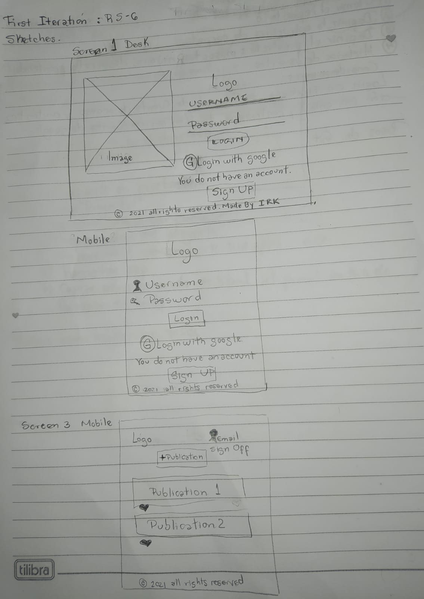
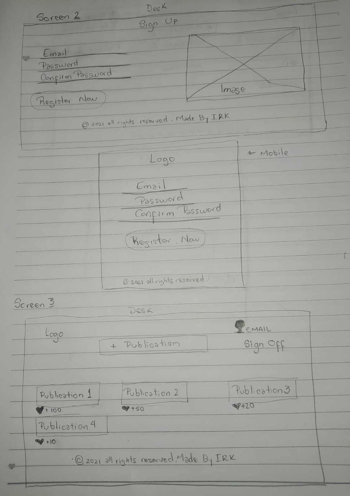
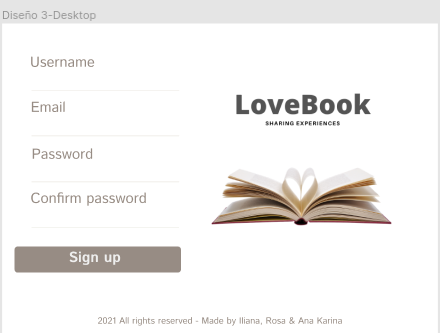
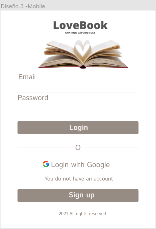

# Creando una Red Social

## Índice

* [1. Resumen del proyecto](#1-resumen-del-proyecto)
* [2. Quiénes son los principales usuarios de producto.](#2-Quiénes-son-los-principales-usuarios-de-producto)
* [3. Qué problema resuelve el producto / para qué le servirá a estos usuarios.](#3-Qué-problema-resuelve-el-producto-/-para-qué-le-servirá-a-estos-usuarios.)
* [4. Criterios de aceptación mínimos del proyecto](#5-criterios-de-aceptación-mínimos-del-proyecto)
## 1. Resumen del proyecto

En este proyecto construiremos una Red Social, la cual permitirá a cualquier usuario crear una cuenta de
acceso y loguearse con ella; crear, editar, borrar y _"likear"_ publicacciones.
 
El objetivo principal de aprendizaje de este proyecto es construir una
[Single-page Application (SPA)](https://es.wikipedia.org/wiki/Single-page_application)
[_responsive_](https://curriculum.laboratoria.la/es/topics/css/02-responsive) (con más de una vista / página)
en la que podamos **leer y escribir datos**.

## 2. Quiénes son los principales usuarios de producto.
  Personas que les guste leer, compartir y escribir reviews de libros.  
## 3. Qué problema resuelve el producto / para qué le servirá a estos usuarios.
  Para hacer una mejor elección del siguiente libro que quieres leer basado en las opiniones de otras personas. 
## 4. Criterios de aceptación mínimos del proyecto
### 4.1 Historias de usuario

Una vez que entiendas las necesidades de tus usuarios, escribe las Historias de
Usuario que representen todo lo que necesitan hacer/ver en la Red Social. Cada
una de tus Historias de Usuario debe tener:

* **Criterios de Aceptación:** todo lo que debe ocurrir para satisfacer las
  necesidades del usuario.

* **Definición de terminado:** todos los aspectos técnicos que deben cumplirse
  para que, como equipo, sepan que esa historia está terminada y lista
  para publicarse. **Todas** tus Historias de Usuario (salvo excepciones), deben
  incluir estos aspectos en su Definición de Terminado (más todo lo que
  necesiten agregar):

  - Debe ser una SPA.
  - Debe ser _responsive_.
  - Deben haber recibido _code review_ de al menos una compañera de otro equipo.
  - Hicieron los _test_ unitarios
  - Testearon manualmente buscando errores e imperfecciones simples.
  - Hicieron _pruebas_ de usabilidad e incorporaron el _feedback_ de los
    usuarios como mejoras.
  - Desplegaron su aplicación y etiquetaron la versión (git tag).

  Creación de cuenta de usuario e inicio de sesión

* _Login_ con Firebase:
  - Para el _login_ y las publicaciones en el muro puedes utilizar [Firebase](https://firebase.google.com/products/database/)
  - Creación de cuenta de acceso y autenticación con cuenta de correo y
    contraseña, y también con una cuenta de Google.
* Validaciones:
  - Solamente se permite el acceso a usuarios con cuentas válidas.
  - No pueden haber usuarios repetidos.
  - La cuenta de usuario debe ser un correo electrónico válido.
  - Lo que se escriba en el campo (_input_) de contraseña debe ser secreto.
* Comportamiento:
  - Al enviarse el formulario de registro o inicio de sesión, debe validarse.
  - Si hay errores, se deben mostrar mensajes descriptivos para ayudar al
  usuario a corregirlos.

#### Muro/timeline

* Validaciones:
  - Al publicar, se debe validar que exista contenido en el _input_.
* Comportamiento:
  - Al recargar la aplicación, se debe verificar si el usuario está _logueado_
    antes de mostrar contenido.
  - Poder publicar un _post_.
  - Poder dar y quitar _like_ a una publicación. Máximo uno por usuario.
  - Llevar un conteo de los _likes_.
  - Poder eliminar un post específico.
  - Pedir confirmación antes de eliminar un _post_.
  - Al dar _click_ para editar un _post_, debe cambiar el texto por un _input_
    que permita editar el texto y luego guardar los cambios.
  - Al guardar los cambios debe cambiar de vuelta a un texto normal pero con la
    información editada.
  - Al recargar la página debo de poder ver los textos editados.

### 4.2 Diseño de la Interfaz de Usuario 

#### Flujo de la aplicación:
 
#### Prototipo de baja fidelidad:
 
 

#### Prototipo de alta Fidelidad:
 
 
